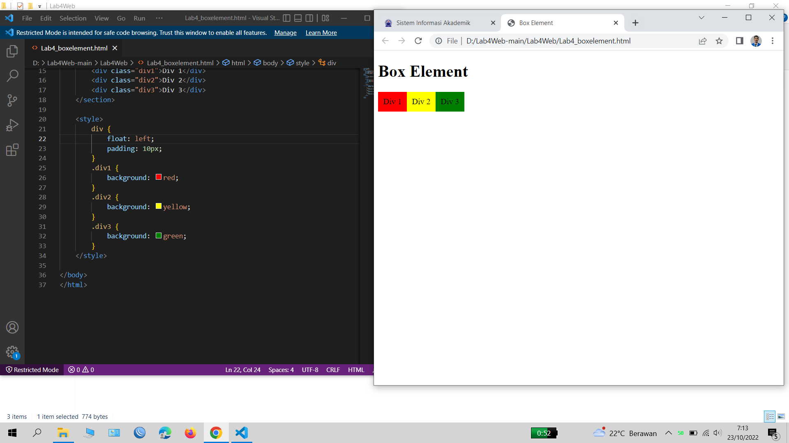

# Lab4Web
# Nama      : Abby Muhammad Titan
# Nim       : 312110546
# Kelas     : TI.21.B1
# UNIVERSITAS PELITA BANGSA
# Langkah 1
# Proses 1
# Membuat Box Element dengan tag div

# Langkah 2
# Proses 2
# Menambahkan deklarasi CSS pada head untuk membuat float element

# Langkah 3
# Proses 3
# BOX ELEMENT FLOAT
# Clearfix digunakan untuk mengatur element setelah float element. Property clear digunakan untuk mengaturnya.
# Kemudian atur property clear pada CSS, seperti berikut.

# Langkah 4
# Proses 4
# Membuat Layout dengan codingan HTML dan CSS

# Langkah 5
# Proses 5
# Menambahkan kode CSS untuk membuat Layout nya

# Langkah 6
# Proses 6
# Membuat Navigasi pada Layout

# Langkah 7
# Proses 7
# Membuat Hero Panel

# Langkah 8
# Proses 8
# Mengatur Layout Main dan Side bar
# Selanjutnya mengatur main content dan sidebar, tambahkan CSS float.

# Langkah 9
# Proses 9
# Mengatur tampilan footer dan menambahkan CSS untuk footer.
# Dan Menambahkan Elemen lainnya pada Main Content dan setelah itu menambahkan CSS

# Langkah Terakhir adalah membuat Content Artikel
# Selanjutnya membuat content artikel. Tambahkan HTML berikut pada main content.
# Dan di tambahkan CSS

# Cukup sekian penjelasan dari saya
# TERIMA KASIH